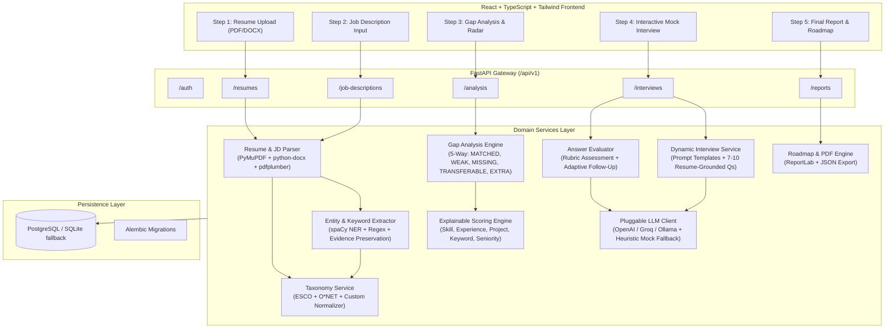

# Resume Intelligence and Mock Interview Platform

A modular, production-ready full-stack AI platform that parses resumes, normalizes skills to official **ESCO** and **O\*NET** taxonomies, runs **5-way skill gap analysis**, computes **explainable match scores**, and dynamically generates **strictly resume-grounded mock interviews** with live AI evaluation and personalized career roadmaps.

---

## System Architecture



---

## Key Features

1. **Deterministic & Evidence-Preserving Extraction**:
   - Parses native and complex PDFs using PyMuPDF (fitz) and Word documents with `python-docx`.
   - Preserves exact bullet citations and resume section provenance for every extracted skill.
   - Configurable section rules via YAML (`config/extraction_rules.yaml`).

2. **Unified ESCO & O\*NET Taxonomy Normalization**:
   - Matches raw terms against canonical titles, aliases, and broader/narrower clusters.
   - Handles common synonyms: `"Reactjs"` $\to$ `"React"`, `"K8s"` $\to$ `"Kubernetes"`, `"postgres"` $\to$ `"PostgreSQL"`.
   - Recognizes transferable skills (e.g., candidate with Flask meets a partial need for FastAPI; MySQL transfers to PostgreSQL).
   - Extensible `custom_skills` table allows registration of newer frameworks without code modification.

3. **5-Way Gap Analysis & Explainable Scoring**:
   - Categorizes every JD requirement as `MATCHED`, `WEAK` (listed without project proof), `MISSING`, `RELATED_PARTIAL`, or `EXTRA`.
   - Evaluates 5 explainable dimensions (0–100):
     $$\text{Overall} = 0.35 \times \text{Skill} + 0.20 \times \text{Experience} + 0.20 \times \text{Project} + 0.15 \times \text{Keyword} + 0.10 \times \text{Seniority}$$
   - Every subscore outputs an itemized $+/-$ point impact list citing resume sentences.

4. **Dynamic Mock Interview Engine**:
   - Generates 7–10 challenging questions grounded in the candidate's actual projects, experience, and identified JD gaps.
   - No generic questions (e.g. "Tell me about yourself").
   - Evaluates submitted answers on technical accuracy, completeness, depth, and clarity.
   - Dynamically produces constructive coaching suggestions and adaptive follow-up questions.

5. **Personalized Career Roadmap & PDF Export**:
   - Synthesizes immediate resume tweaks, short-term learning actions with timeframes, recommended portfolio projects with problem statements, strategic certifications, and interview focus areas.
   - One-click PDF download generated server-side using ReportLab.

---

## Project Structure

```
resume-intelligence-platform/
├── backend/
│   ├── app/
│   │   ├── main.py                  # FastAPI application entry point
│   │   ├── core/                    # Config, security, database, exceptions
│   │   ├── api/                     # REST routes (/auth, /resumes, /job-descriptions, /analysis, /interviews, /reports)
│   │   ├── schemas/                 # Pydantic v2 schemas
│   │   ├── services/                # Business logic services (parser, taxonomy, scorer, LLM, interview, etc.)
│   │   ├── models/                  # SQLAlchemy models (User, Resume, JobDescription, Analysis, Taxonomy, Interview)
│   │   ├── repositories/            # Data access layer
│   │   ├── prompts/                 # Separate Jinja2 prompt template files
│   │   ├── config/                  # extraction_rules.yaml
│   │   ├── workers/                 # Background tasks
│   │   └── utils/                   # Text cleaner, PDF generator, structured logger
│   ├── scripts/
│   │   ├── import_esco.py           # ESCO dataset importer & seeder
│   │   ├── import_onet.py           # O*NET database importer & seeder
│   │   └── seed_roles.py            # Benchmark occupations and custom skills
│   ├── tests/                       # Complete unit & integration test suite
│   ├── alembic/                     # Database migrations
│   ├── requirements.txt
│   ├── .env.example
│   └── Dockerfile
├── frontend/
│   ├── src/
│   │   ├── pages/                   # Multi-step wizard views
│   │   ├── components/              # Stepper, ScoreCard, SkillGapBadge, QuestionCard, AnswerFeedback, RoadmapCard
│   │   ├── context/                 # Application state
│   │   ├── api/                     # Typed client
│   │   └── types/                   # TypeScript schemas
│   ├── package.json
│   ├── vite.config.ts
│   └── Dockerfile
├── docker-compose.yml
└── README.md
```

---

## Quickstart Guide

### 1. Backend Setup (Local Development)

```bash
cd backend

# 1. Install dependencies
pip install -r requirements.txt
python -m spacy download en_core_web_sm

# 2. Configure environment (uses local SQLite by default)
cp .env.example .env

# 3. Apply database migrations & seed taxonomy
alembic upgrade head
python scripts/seed_roles.py

# 4. Run tests
python -m pytest tests/ -v

# 5. Start development server
uvicorn app.main:app --reload --port 8000
```

Access Swagger UI at `http://localhost:8000/api/v1/docs`.

### 2. Frontend Setup

```bash
cd frontend
npm install
npm run dev
```

Visit the application at `http://localhost:3000`.

### 3. Docker Compose (Full-Stack Deployment)

To start PostgreSQL, the FastAPI Backend, and the React Frontend simultaneously:

```bash
docker-compose up --build
```

---

## API Reference

### Resume Endpoints
- `POST /api/v1/resumes/upload`: Upload PDF or DOCX resume.
- `GET /api/v1/resumes/{resume_id}`: Retrieve parsed resume data.
- `GET /api/v1/resumes/{resume_id}/status`: Check processing status.

### Job Description Endpoints
- `POST /api/v1/job-descriptions`: Accepts raw text, document upload, or public job posting URL.
- `GET /api/v1/job-descriptions/{jd_id}`: Retrieve parsed job requirements.

### Analysis Endpoints
- `POST /api/v1/analysis`: Executes 5-way taxonomy matching and 5-factor explainable scoring.
- `GET /api/v1/analysis/{analysis_id}`: Retrieves complete analysis record.

### Interview Endpoints
- `POST /api/v1/interviews`: Generates 7–10 resume-grounded mock interview questions.
- `GET /api/v1/interviews/{interview_id}`: Retrieves questions and submitted answers.
- `POST /api/v1/interviews/{interview_id}/answers`: Submits candidate response and receives AI evaluation.
- `POST /api/v1/interviews/{interview_id}/complete`: Finalizes interview and calculates composite interview grade.

### Report Endpoints
- `GET /api/v1/reports/{analysis_id}`: Consolidated report and personalized career roadmap.
- `GET /api/v1/reports/{analysis_id}/download`: Downloadable PDF report.
